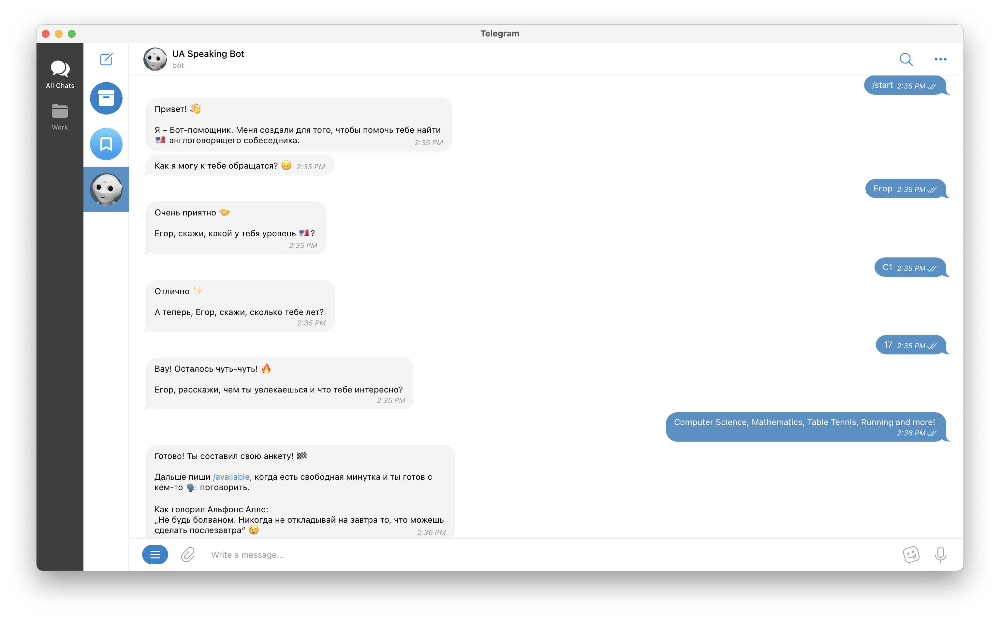

ua-speaking-bot
===============
This is a Telegram bot I coded to help Ukrainian refugees find speaking partners of their level and age.

  
Note

  the bot isn't running at the moment, because I wasn't able to find some money to pay for the hosting.

### TODO
[ ] Feature: mute a member until the registration is complete  
[ ] Remind users to have a break and write /available using AI when it's appropriate  
[ ] Use PostgreSQL  
[ ] Make it multilingual  
